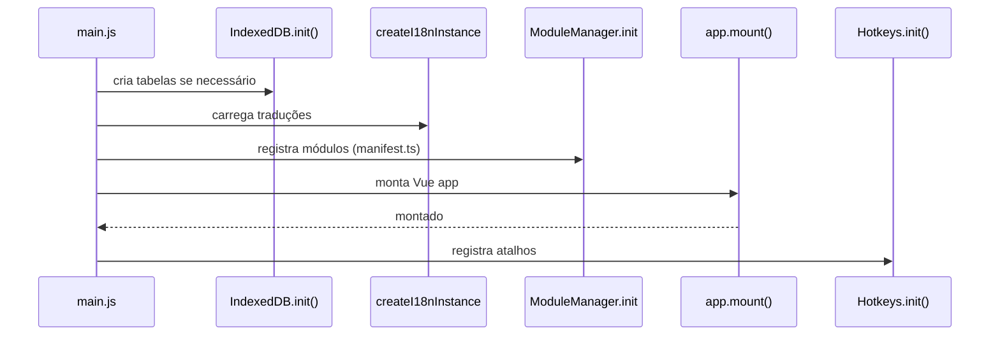

# 🏗 Arquitetura do Sistema

## 📌 Visão Geral

O LouvorJA é uma SPA baseada em Vue 3 + TypeScript com arquitetura modular dinâmica.
Versão web/desktop do sistema original em Delphi (`louvorja-desktop`).

**Plataformas:**

- **Web/PWA** — servido via Vite/Vercel
- **Desktop** — Electron 41 (empacotamento NSIS/DMG/AppImage)

A aplicação é composta por:

- Core (App, Router, Pinia Store, Plugins)
- Layout System (Shell com Ribbon / Módulos)
- Module Loader automático via `import.meta.glob`
- Pinia Global Store (migrado de Vuex)
- Sistema de Internacionalização (Vue I18n 11)
- IndexedDB unificado (`louvorja`) para dados offline

---

## 🧠 Stack

| Tecnologia | Versão | Uso |
|---|---|---|
| Vue | 3.5 | Framework |
| Vuetify | 4.0.6 | UI + temas |
| Pinia | 3 | Estado global |
| Vue Router | 5.0.6 | Rotas |
| Vue I18n | 11 | Traduções PT/ES |
| TypeScript | 6 | Tipagem |
| Vite | 7 | Build |
| Electron | 41 | Desktop nativo |
| idb | — | IndexedDB wrapper |
| pdfjs-dist | 6 | Renderização de PDF |

---

## 🧩 Arquitetura Modular

Cada módulo em `src/modules/<id>/` segue esta estrutura:

```text
<id>/
├── manifest.ts          # Metadados + Ribbon pages
├── index.ts             # Registra o módulo — importa `./manifest`
├── components/          # Componentes Vue do módulo
│   └── Index.vue        # Componente principal
└── lang/                # Traduções do módulo
    ├── pt.json
    └── es.json
```

### manifest.ts

```ts
import { ModuleEnum } from "@/enums/ModuleEnum"
import { ICONS } from "@/config/Icons"
import $modules from "@/helpers/Modules"

const moduleId = ModuleEnum.BIBLE;
const modulePath = $modules.getPath(moduleId);
const moduleCtxId = "ctx_" + moduleId;

export const module: Module = {
  id: moduleId,
  title: `${modulePath}.title`,
  description: `${modulePath}.description`,
  showInMainMenu: true,
  icon: ICONS.MODULES.BIBLE,
  color: "#c0392b",
  category: ModuleCategoryEnum.BIBLE,
  group: ModuleGroupEnum.BIBLE_GENERAL,
  order: 0,
  dependencies: [],
}
```

### Menu contextual (RibbonPage)

```ts
export const contextualPages: RibbonPage[] = [
  {
    id: moduleCtxId,
    title: `${modulePath}.ribbon.title_ctx`,
    contextual: true,
    activeOnModules: [moduleId],
    groups: [
      {
        id: `${moduleCtxId}_actions`,
        title: "ribbon.groups.actions",
        buttons: [
          { id: `${moduleId}_play`, icon: ICONS.PLAYER.PLAY, ... },
        ],
      },
      {
        id: `${moduleCtxId}_wallpaper`,
        title: `${modulePath}.ribbon.wallpaper`,
        customCategory: RibbonWallpaper,  // ← componente Vue importado diretamente
      },
    ],
  },
]
```

### Tipos de botão na ribbon

| Tipo | Descrição |
|------|-----------|
| `action` | Botão padrão que dispara `MODULE_RIBBON_ACTION` |
| `checkbox` | Checkbox ligado a `optionKey` no UserData |
| `switch` | Vuetify v-switch |
| `select` | `<select>` com opções de `optionKey` |
| `slider` | Vuetify v-slider com `min`/`max`/`step` |
| `screen` | Botão de projeção com seletor de monitores |
| `customCategory` | Grupo inteiro substituído por componente Vue |

---

## 🔄 Gerenciamento de Estado

### UserData (preferências persistidas)

```ts
import $userdata from "@/helpers/UserData";
import { KEYS } from "@/constants/UserDataKeys";

// Sempre usar KEYS.* — NUNCA strings hardcoded
$userdata.get(KEYS.OPTIONS.THEME);
$userdata.set(KEYS.OPTIONS.THEME, "dark");
```

Todas as chaves de `$userdata.get/set` **devem** ser referenciadas via `KEYS.*` de
`src/constants/UserDataKeys.ts`. Nunca use strings literais como `"theme"` ou
`"options.auto_cache_media"` — isso quebra a rastreabilidade e dificulta refatorações.

Estrutura do `user_data` no Pinia store:

```js
{
  theme: string,
  language: "pt" | "es",
  layout: "apps" | "ribbon",
  remote: { is_connected, url, token },
  modules: { [moduleId]: { search, filter, ...customization } },
  options: {
    /* slides, player, projeção */
    // Auto-update (KEYS.OPTIONS.*):
    use_beta_updates: boolean,          // considera pré-releases
    check_updates_on_start: boolean,    // verifica ao iniciar
    auto_download_updates: boolean,     // baixa automaticamente
    last_app_check: string | null,      // última verificação (ISO)
  }
}
```

Estado volátil da shell (AppData, não persistido):

```js
// appdata (KEYS.SHELL.*)
{
  is_dark: boolean,
  app_update_available: boolean,
  app_update_version: string,
}
```

Se precisar de uma nova chave, adicione o entry em `KEYS.*` em
`src/constants/UserDataKeys.ts` antes de usar no código.

### IndexedDB unificado (`louvorja`)

Gerenciado via `src/helpers/IndexedDB.ts`. Tabelas definidas em `src/constants/DbTables.ts`.

```
louvorja/
├── background_projection_library
├── background_projection_categories
├── background_sound_categories
├── media_deck_library
├── settings              ← wallpaper, preferências diversas
└── ... (futuras migrações)
```

Helper genérico para a tabela `settings`:

```ts
import { getSetting, saveSetting } from "@/helpers/SettingsStorage";

await saveSetting({ id: "main", image: arrayBuffer, mime: "image/png", color: "#000", position: "cover" });
const wp = await getSetting("main");
```

---

## 🌎 Internacionalização

- Tradução global em `src/lang/pt.json` e `src/lang/es.json`
- Tradução por módulo em `src/modules/<id>/lang/`
- Chave de tradução: `modules.<id>.<key>` no i18n global

---

## ⌨️ Atalhos de Teclado

| Tipo | Implementação | Quando funciona |
|------|--------------|----------------|
| **In-window** | `src/helpers/Hotkeys.js` | Apenas com janela do app em foco |
| **Global (OS-level)** | `electron/main/shortcuts.js` | System-wide |

Atalhos in-window registrados em `src/main.js` via `Hotkeys.register()`.

---

## 🔌 Helpers vs Composables

| Tipo | Descrição |
|------|-----------|
| **Helper puro** | JS/TS sem APIs Vue. Seguro no Electron main process |
| **Acoplado a Pinia** | Acessa o store. Funciona apenas no renderer |
| **Composable** | Usa APIs Vue, chamado dentro de `setup()` |

Helpers principais:

| Helper | Função |
|--------|--------|
| `Path.ts` | Constrói URLs (`db`, `file`, `local` — `louvorja://`) |
| `Broadcast.ts` | BroadcastChannel("louvorja") — multi-listener |
| `BroadcastTypes.ts` | Constantes de broadcast (50+ tipos) |
| `Projection.ts` | Abertura unificada de janelas de projeção |
| `ProjectionWindows.ts` | Abre/fecha janelas por feature (monitor-aware) |
| `IndexedDB.ts` | CRUD unificado no IndexedDB |
| `SettingsStorage.ts` | CRUD na tabela `settings` do IDB |
| `FilePicker.ts` | `pickImage()` e `pickImageData()` — seletor de imagens |
| `UserData.ts` | Preferências do usuário (Pinia + persistência) |
| `Hotkeys.js` | Atalhos de teclado in-window |
| `Snackbar.ts` | Snackbar global; aceita `action?: () => void` opcional (executada no clique) |
| `Platform.js` | Adapter web/desktop |

---

## 📡 Comunicação Entre Janelas

Canal único `BroadcastChannel("louvorja")`. Duas finalidades:

| Categoria | Descrição | Escopo |
|---|---|---|
| **cross-window** | Sincronizam estado entre janelas (Projeção, OBS) | Multi-janela (mesmo origin) |
| **in-app** | Hotkeys e eventos HTTP → módulos Vue | Mesma janela |

> ✅ **Electron**: `BroadcastChannel` funciona entre `BrowserWindow` (sandbox: false, mesma origem).

### Principais tipos cross-window

| Tipo | Emissor | Receptor |
|---|---|---|
| `slide_change` | useSlides | Projection, ProjectionReturn, Obs, Operator |
| `bible_verse` | bible/Index.vue | ObsBible, ProjectionBible |
| `media_close` | useMedia.close() | Projection, Obs, FileProjection |
| `file_projection` | liturgy / media_deck | FileProjection, FileProjectionReturn |
| `background_projection` | background_projection | BackgroundProjection |
| `wallpaper_update` | RibbonWallpaper, Opções | BackgroundProjection, FileProjection |
| `module_ribbon_action` | RibbonBar | Módulo alvo |
| `userdata:patch` | UserData.set() | Todas as janelas |

---

## 🔄 Auto-update do app (D8)

O auto-update é gerenciado por `electron/main/updater.js` e exposto ao renderer
via `Platform.updater`. O comportamento varia conforme a plataforma:

| Instalação | Check | Download / Instalação |
|---|---|---|
| **Windows (NSIS)** | electron-updater (provider GitHub) | electron-updater — `.exe` + blockmap (diferencial) + instalação silenciosa |
| **macOS (DMG/zip)** | electron-updater | electron-updater — `.zip` (substitui o `.app`) |
| **Linux AppImage** | electron-updater | electron-updater — substitui o AppImage |
| **Linux deb/rpm** | GitHub API (`checkGithubRelease`) | download manual do asset `.deb`/`.rpm` → abre no gerenciador de pacotes |

### Opções da tela de Atualizações

Persistidas em `user_data.options` e aplicadas em runtime via `Platform.updater.setOptions()`:

| Opção | Chave (`KEYS.OPTIONS`) | Efeito |
|---|---|---|
| Usar versões beta | `USE_BETA_UPDATES` | `autoUpdater.allowPrerelease` (GitHub provider). Default `true` durante preview — **TODO: remover default ao publicar versão estável** |
| Verificar novas versões ao iniciar | `CHECK_UPDATES_ON_START` | Check no boot (disparado pelo renderer em `Shell.vue`) |
| Baixar atualizações automaticamente | `AUTO_DOWNLOAD_UPDATES` | Baixa em background quando encontra versão nova |
| Última verificação | `LAST_APP_CHECK` | Timestamp do último check bem-sucedido (não grava em erro) |

### Fluxo no boot

1. `Shell.vue` (renderer) dispara o check ao iniciar (`Platform.updater.check()`).
2. Em **dev** (app não empacotado) ou **deb/rpm**, o check cai para a **GitHub API**
   (`checkGithubAndSetState`), que funciona em qualquer ambiente.
3. Se houver versão nova e **auto-download desligado**: snackbar clicável com o número
   da versão → abre a tela de Atualizações (`AppMenuAtualizacoes`).
4. Se houver versão nova e **auto-download ligado**: baixa em background e acende o
   badge de atualização na `ShellTools`.
5. Estado propagado ao renderer via IPC `updater:state` (`Platform.updater.onStateChange`).

### Badge da ShellTools

`ShellTools.vue` mostra um ícone **amarelo pulsante** (`mdi-download-circle`) quando
`appdata app_update_available` é verdadeiro. O clique abre a tela de Atualizações via
evento `louvorja:open-updates` (escutado por `AppMenu.vue`).

### IPC handlers principais

| Canal | Função |
|---|---|
| `updater:check` | Check (electron-updater ou GitHub API conforme plataforma) |
| `updater:download` | Download (electron-updater) |
| `updater:downloadPackage` | Download manual do asset `.deb`/`.rpm` (Linux) com progresso |
| `updater:openPackage` | Abre o pacote baixado no gerenciador de pacotes |
| `updater:openReleasePage` | Abre a release no browser (fallback) |
| `updater:getInstallType` | Retorna `"appimage"` \| `"deb"` \| `"rpm"` |
| `updater:setOptions` | Aplica `{ useBeta, autoCheck, autoDownload }` em runtime |
| `updater:install` | Fecha o app e instala a atualização baixada |
| `updater:status` | Snapshot do estado atual |

---

## 🌐 Servidor HTTP embarcado (D5)

Express servindo a SPA Vue + API `/api/*` + SSE `/events` (OBS/celular),
com aliases Delphi (`/musica`, `/biblia`). Roda sempre — janelas auxiliares
do Electron dependem da origem HTTP para YouTube IFrame API e BroadcastChannel.

### Fallback de porta

A porta base é **7070** (ou a salva no `userStore`). Se estiver em uso:

1. **Probe de porta** (`_probePort`) — testa TCP em `127.0.0.1` e `[::1]`
   antes de escolher. Detecta qualquer listener na porta, incluindo o
   servidor da versão Delphi do LouvorJA (que pode escutar em IPv6 e não
   geraria `EADDRINUSE` no bind IPv4 do Express).
2. Se ocupada, sorteia uma **porta aleatória no range 7000–8000**
   (até 100 tentativas), com `EADDRINUSE` como rede de segurança.
3. A porta efetiva é persistida e propagada ao renderer (`httpServer.status()`),
   `HTTP_BASE_URL` do main e tela Transmitir.
4. Se **todas** as tentativas falharem: o app exibe um dialog de erro
   ("Não foi possível iniciar o aplicativo — não foi possível reservar uma
   porta") e fecha ao clicar OK.


---

## 🗂 Estrutura de Diretórios

```
src/
├── components/              # Componentes reutilizáveis globais
│   ├── CategoryManagerDialog.vue  # Diálogo de categorias (compartilhado)
│   ├── OverlayRenderer.vue        # Overlays sobre projeção
│   ├── Slide.vue                  # Renderizador de slides
│   └── format-fields/             # Campos de formatação (FieldColor, FieldFont, etc.)
├── composables/             # Composables Vue reativos
│   ├── useProjectionState.ts      # Estado da projeção
│   ├── useSlideStyle.ts           # Estilos de slides
│   └── useBroadcastListener.ts    # Listener BroadcastChannel c/ cleanup
├── constants/
│   ├── DbTables.ts           # Nomes das tabelas do IndexedDB
│   ├── Projection.ts         # Constantes de projeção
│   └── UserDataKeys.ts       # Chaves de user_data
├── helpers/                  # Utilitários
│   ├── Broadcast.ts / BroadcastTypes.ts
│   ├── IndexedDB.ts
│   ├── FilePicker.ts
│   ├── SettingsStorage.ts
│   ├── Snackbar.ts           # Snackbar global (suporta action opcional)
│   └── ...
├── modules/                  # 30+ módulos do sistema
│   ├── background_projection/    # Projeção de fundo
│   ├── background_sound/         # Música de fundo
│   ├── overlay/                  # Overlays customizáveis
│   └── ...
├── views/                    # Rotas de projeção
│   ├── Projection.vue
│   ├── FileProjection.vue
│   ├── BackgroundProjection.vue
│   └── ...
└── router/                   # Vue Router (hash + history)
```

---

## 🔧 Comandos

```bash
npm run dev                  # Web/PWA → http://localhost:5002
npm run build                # Build produção
npm run electron:dev         # Desktop (Electron)
npm run electron:build       # Build instalável
npm run typecheck            # TypeScript
npm run validate:manifests   # Valida manifest.ts de módulos
npm run lint                 # ESLint
npm run test                 # Vitest
npm run test:e2e             # Playwright
```

---

## 📦 Dependências principais

- Vue 3.5 + Composition API
- Vuetify 4 ~4.0.6
- Pinia 3
- Vue Router 5
- Vue I18n 11
- TypeScript 6
- Vite 7
- Electron 41
- idb (IndexedDB)
- pdfjs-dist
- jszip
- fuse.js
- basic-ftp
- vitest + Playwright

---

## 👷 Adaptador Web/Desktop

```js
// src/helpers/Platform.js
export default {
  isDesktop: typeof window !== "undefined" && !!window.louvorjaApi,
  api: typeof window !== "undefined" ? window.louvorjaApi : null,
};
```

`window.louvorjaApi` é exposto pelo `preload.cjs` via `contextBridge`. Helpers com comportamento diferente entre web e desktop verificam `Platform.isDesktop`.

---

## 🚀 Fluxo de Boot



---

## 🔧 Build e Bundling

Vite 7 com `manualChunks` para separar vendor chunks:

- `vendor-vue`: Vue 3 + Vue Router + Pinia + Vue I18n
- `vendor-i18n`: vue-i18n
- `vendor-fuse`: fuse.js

Aliases em `vite.config.js`:

| Alias | Resolve |
|---|---|
| `@` | `src/` |
| `@helpers` | `src/helpers/` |
| `@modules` | `src/modules/` |
| `@components` | `src/components/` |
| `@constants` | `src/constants/` |
| `@store` | `src/store/` |
| `@views` | `src/views/` |

---

## 📐 Convenções de Código

### `ICONS.*` — sempre, nunca `"mdi-*"` hardcoded

Ícones de componentes e manifestos **devem** usar as constantes de `src/config/Icons.ts`:

```ts
import { ICONS } from "@/config/Icons";

// ✅ Correto
icon: ICONS.PLAYER.PLAY

// ❌ Errado — string hardcoded
icon: "mdi-play"
```

Exceção: templates de módulos com `<v-icon icon="mdi-...">` inline são tolerados
mas **prefira** extrair para `ICONS.*`.

### `KEYS.*` — UserData nunca com string literal

Toda leitura/escrita em `$userdata.get/set` **deve** usar as constantes de
`src/constants/UserDataKeys.ts`:

```ts
import $userdata from "@/helpers/UserData";
import { KEYS } from "@/constants/UserDataKeys";

// ✅ Correto
$userdata.get(KEYS.OPTIONS.THEME);

// ❌ Errado — string hardcoded
$userdata.get("theme");
```

Para adicionar nova chave: edite `src/constants/UserDataKeys.ts` e referencie
via `KEYS.<GROUP>.<KEY>` no código.

---

## 📚 Referências

- `src/helpers/BroadcastTypes.ts` — Contratos e payloads do BroadcastChannel
- `docs/adr/0001-vuetify-versao-estavel.md` — Vuetify travado em ~4.0.6
- `docs/adr/0002-vue-router-version.md` — Vue Router 5
- `docs/adr/0003-modules-core-flat.md` — Sem diretório `modules/core/`
